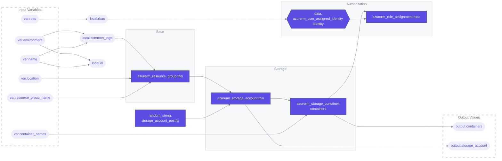

# Terraform Azure Blob Storage Module

## Overview
This Terraform configuration is designed to facilitate the deployment and management of Azure Blob Storage resources. It offers an efficient way to create and manage storage accounts and containers in Azure.

### Terraform Architecture

## Features
- **Resource Group Creation**: Sets up an Azure resource group.
- **Storage Account Management**: Automates the creation of Azure Storage Accounts.
- **Storage Containers**: Handles the creation of multiple storage containers.
- **RBAC Configuration**: Manages role-based access control for the storage containers using user-assigned identities.

## File Structure
- [`01-providers.tf`](./01-providers.tf): Specifies the required providers such as AzureRM, Helm, AzAPI, Random, and AzureAD.
- [`outputs.tf`](./outputs.tf): Includes outputs like storage account and container details.
- [`variables.tf`](./variables.tf): Contains all the necessary variables like resource group name, location, environment, container names, and RBAC settings.

## Example
For examples on how to use this configuration, refer to the [`example`](./example) directory.

## Workflows
| Name | Description |
|---|---|
| [terraform-ci.yaml](.github/workflows/terraform-ci.yaml) | A workflow for linting and auto-formatting Terraform code. Triggered by pushes to  `main` and `dev` branches or on pull requests, it consists of two jobs: `tflint` for lint checks, `format` for code formatting and submit a PR, and `tfmermaid` to update architecture graph and submit a PR. |
